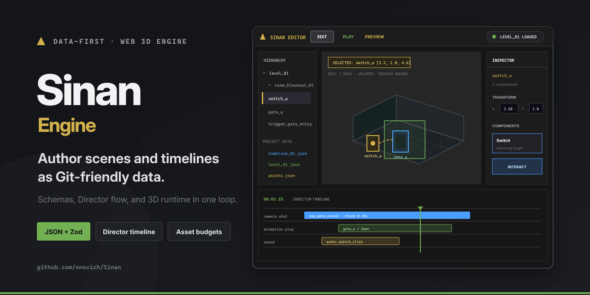

# Sinan

[简体中文](README.zh-CN.md)

A data-first Web 3D engine and editor where scenes and rules are expressed through JSON, schemas, and tests.



## What it includes

- Data-first scenes and rules.
- Web 3D editor and runtime.
- Schema-backed automated tests.

## Getting started

Install dependencies and start the local version:

```bash
npm install
npm run dev
```

The repository also provides `npm run build`、`npm run test`、`npm run lint`.

## Repository map

- `src/` — Application and library source.
- `scripts/` — Runtime or automation scripts.
- `data/` — Structured project data.
- `docs/` — Project documentation and design notes.
- `tests/` — Automated tests and validation fixtures.

## Documentation

- [`docs/developer-guide.md`](docs/developer-guide.md)
- [`docs/editor-ui-design-parity-requirements.md`](docs/editor-ui-design-parity-requirements.md)
- [`docs/editor-ui-ux-redesign-brief.md`](docs/editor-ui-ux-redesign-brief.md)
- [`docs/editor-ui-ux-variant-style-guide.md`](docs/editor-ui-ux-variant-style-guide.md)
- [`docs/engine-positioning-architecture-adjustment-plan.md`](docs/engine-positioning-architecture-adjustment-plan.md)

## Status

Sinan has a substantial editor/runtime implementation and test suite, but several adapters remain replaceable prototypes. In particular, the local WebSocket adapter is not production networking.

## License

No open-source license is currently included in this repository.
