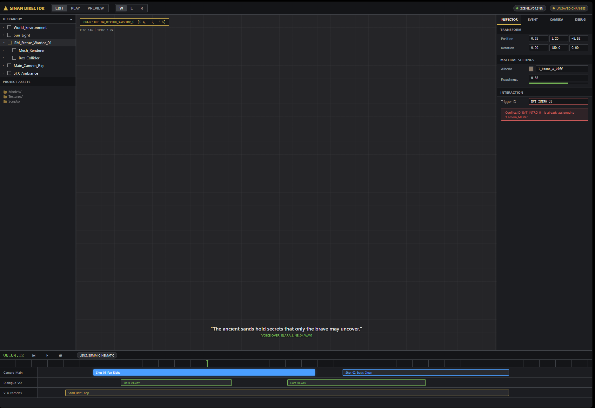

# Sinan Editor Variant Style Guide

This guide freezes the selected Variant direction into a local Sinan design reference. Use it when implementing the editor UI/UX pass, especially if later Variant outputs drift away from the selected style.

Reference image:



Standalone static prototype:

- `docs/ui-reference/sinan-editor-static-prototype.html`
- Desktop verification capture: `docs/ui-reference/sinan-editor-static-prototype-desktop.png`
- Interaction-state capture: `docs/ui-reference/sinan-editor-static-prototype-interaction.png`
- Narrow verification capture: `docs/ui-reference/sinan-editor-static-prototype-narrow.png`
- Interaction audit and handoff matrix: `docs/editor-ui-ux-interaction-audit.md`

## Style Thesis

The selected direction is a compact dark 3D editor and cinematic sequencer. It should feel closer to a DCC/game-tool workstation than a SaaS admin dashboard.

Core traits:

- Near-black chrome around a slightly lighter viewport.
- Thin mechanical separators, not floating cards.
- Dense uppercase labels for tool chrome.
- Mono text for ids, coordinates, timecode, and technical telemetry.
- Yellow/gold for brand, selected entity, warnings, and unsaved state.
- Blue for selected clips, focus, and information.
- Green for playback, saved state, audio/subtitle runtime feedback, and timecode.
- Red for validation errors and conflicts.
- Very small radii and minimal shadows.

Do not add decorative gradients, blob backgrounds, oversized headings, hero composition, or broad card stacks. The atmosphere should come from precision, contrast, and sequencer structure.

## Design Tokens

Start with these tokens, then tune only after screenshot review:

```css
:root {
  --sinan-bg-chrome: #141518;
  --sinan-bg-panel: #1c1d21;
  --sinan-bg-active: #2a2b2f;
  --sinan-bg-viewport: #252528;
  --sinan-border: #3f4247;
  --sinan-text-primary: #e0e0e0;
  --sinan-text-secondary: #a0a0a5;
  --sinan-accent-green: #72b053;
  --sinan-accent-yellow: #d4b24c;
  --sinan-accent-blue: #4a9eff;
  --sinan-accent-red: #cc5a5a;
  --sinan-radius-sm: 2px;
  --sinan-radius-md: 4px;
  --sinan-toolbar-height: 40px;
  --sinan-left-rail-width: 240px;
  --sinan-right-rail-width: 300px;
  --sinan-timeline-min-height: 180px;
  --sinan-font-ui: Inter, ui-sans-serif, system-ui, -apple-system, BlinkMacSystemFont, 'Segoe UI', sans-serif;
  --sinan-font-mono: 'JetBrains Mono', 'Fira Code', Consolas, 'Liberation Mono', monospace;
}
```

Implementation notes:

- Keep letter spacing at `0` for production, even if the reference uses slight negative spacing in the brand.
- Do not rely on emoji icons. Use lucide icons or the existing icon strategy when icons are introduced.
- Avoid inline styles. Promote repeated one-off values into classes or tokens.
- Use CSS variables with project-safe names rather than copying generic `--bg-main` names directly.

## Shell Layout

Desktop target:

- App height: `100vh`.
- Top toolbar: `40px`.
- Main grid columns: `240px minmax(0, 1fr) 300px`.
- Bottom sequencer: minimum `180px`; Sinan may need `220px` or a resizable row once track editing is added.
- No document-level vertical scroll; side rails and sequencer own their scroll.

The selected reference uses this visual ratio:

```css
.editor-shell {
  grid-template-rows: var(--sinan-toolbar-height) minmax(0, 1fr) minmax(180px, 24vh);
}

.editor-workbench {
  grid-template-columns:
    var(--sinan-left-rail-width)
    minmax(0, 1fr)
    var(--sinan-right-rail-width);
}
```

## Toolbar

Required clusters:

- Brand: warning-triangle or compass-like mark plus `SINAN DIRECTOR` or `Sinan Scene Director`.
- Mode switch: `Edit`, `Play`, `Preview`.
- Tool switch: `Select`, `Move`, `Rotate`, `Scale`.
- History: undo/redo.
- Helper toggle: trigger bounds / helper layer.
- Save/status area: scene/level status and dirty/save state.

Visual treatment:

- Toolbar background uses `--sinan-bg-chrome`.
- Segmented controls sit inside a thin bordered shell.
- Active mode fills with `--sinan-border` or `--sinan-bg-active`.
- Edit active: yellow or neutral with yellow underline.
- Play active: green.
- Preview active: amber/yellow.
- Status pills are small rounded capsules with a colored dot.

Avoid exposing only `W/E/R` in production. They can remain as keyboard hints, but controls should also have accessible labels and tooltips.

Suggested lucide icon names:

- Select: `MousePointer2`
- Move: `Move3D`
- Rotate: `Rotate3D`
- Scale: `Scaling`
- Undo: `Undo2`
- Redo: `Redo2`
- Save: `Save`
- Play: `Play`
- Pause: `Pause`
- Stop: `Square`
- Start: `SkipBack`
- End: `SkipForward`
- Trigger/helper layer: `BoxSelect` or `Scan`

## Left Rail

The left rail combines hierarchy and project assets. It should feel like a scene outliner.

Hierarchy:

- Rows are 24-28px high.
- Selected entity uses `--sinan-bg-active` plus a 2px yellow left border.
- Nested component rows are indented and visually quieter.
- Entity type/prefab can use a small square outline icon.
- Long names truncate, but stable ids should remain available through tooltip/title.

Assets:

- Keep below hierarchy with a hard separator.
- Show compact asset rows or folders.
- For current Sinan data, prefer asset id, type, and url over fake folders when implementing.

Missing states to define:

- Loading level.
- No entities.
- Selected entity missing from data.
- Asset failed to load.

## Viewport

The viewport should remain the visual center.

Reference elements:

- Dark grid surface for mock/reference states.
- Real implementation keeps the Three canvas; grid styling should only appear behind or as runtime/editor helpers when useful.
- Top-left overlay: selected entity id and position.
- Secondary telemetry line: frame/runtime/debug info.
- Bottom-center subtitle/runtime feedback.

Viewport overlay rules:

- Overlay should not block interaction.
- Keep max width constrained.
- Use mono font for ids and coordinates.
- Selection tag uses yellow border and text.
- Runtime voice/audio status uses green.
- Error/runtime blocked status uses red.

Sinan-specific overlays:

- Selected: `switch_a [x, y, z]`
- Mode/tool: `EDIT / MOVE`
- Timeline preview: `tl_open_gate @ 2.25s`
- Subtitle: existing runtime subtitle HUD
- Audio: existing runtime audio HUD
- Optional helper toggles: trigger bounds, camera frustum, nav/debug layers

## Right Rail Tabs

Keep right rail tabs exactly as the chosen direction suggests:

- `Inspector`
- `Event`
- `Camera`
- `Debug`

Tab styling:

- Equal-width tabs.
- Uppercase, 10-11px.
- Active tab uses yellow bottom border and panel-colored background.
- Inactive tabs use secondary text.
- Dirty tabs get a small yellow dot.
- Invalid tabs get a small red dot.

### Inspector Tab

Sections:

- Entity summary: name, id, prefab/type.
- Transform: position, rotation, scale as grouped triplet inputs.
- Components: typed component sections.
- Actions: context commands such as interact.
- Advanced/raw JSON: collapsed by default.

Rules:

- Field label column around 72-88px.
- Mono font for numeric values and ids.
- Component raw payload should not dominate the first view.
- Validation appears directly below the affected group.

### Event Tab

Sections:

- Event selector.
- Name/id and save status.
- Trigger summary.
- Condition summary.
- Action list.
- Validation/conflict panel.
- Apply/save commands.

Visual mapping:

- Trigger rows can use yellow accents.
- Conditions use neutral/blue.
- Actions use type-colored chips:
  - `flag.set`: yellow
  - `timeline.play`: blue
  - `camera.playShot`: blue
  - `sound.play`: green
  - `subtitle.show`: green
  - destructive/runtime-only actions: red or warning tone

### Camera Tab

Sections:

- Shot selector and create/save commands.
- Current shot summary: id, type, duration, dirty/save/preview status.
- Keyframe selector.
- Time, FOV, position, look-at.
- Commands: `Set Key From View`, `Look At Selected`, `View Through Camera`.
- Preview status.

Visual mapping:

- Camera shot rows use blue.
- Current key uses selected blue fill.
- Preview-through-camera status uses yellow/blue hybrid treatment.
- Invalid keyframe values use red inline validation.

### Debug Tab

Sections:

- Summary counts: fired events, active flags, door states, director commands.
- Compact event log.
- Flags table.
- Door/entity state list.
- Director command queue.

Rules:

- Debug should be dense and technical.
- Use mono text for ids and command types.
- Use colored dots for state transitions.
- Keep it clearly separate from authoring controls.

## Sequencer / Timeline

The selected reference gives the strongest usable direction: use lanes, not cards.

Required structure:

- Top sequencer controls row:
  - Timecode
  - Playback controls
  - Current timeline / lens / preview status pill
  - Save/dirty state
- Ruler:
  - Thin vertical ticks.
  - Green playhead with small triangular cap.
- Lanes:
  - Fixed left label column around 120px.
  - Track content area with absolute-positioned clips/markers.
  - 32px lane height baseline.

Track color mapping:

- `camera.shot`: blue clip.
- `sound`: green outlined clip.
- `subtitle`: green text or softer green clip.
- `action`: yellow marker or short yellow clip.
- `animation.play`: blue/purple-blue is acceptable, but avoid making the whole UI purple.
- `property`: neutral gray line with yellow/blue key dots.
- `wait`: neutral outlined block.

Selected clip:

- Blue fill, white text, subtle blue glow.
- Selection must not change lane height.

Validation:

- Invalid clip has red border and optional red corner mark.
- Timeline-level invalid state appears in controls row as a red status pill.

Editing:

- Selected track details may live under the lanes or in the right rail.
- Keep raw action JSON collapsed when a structured editor exists.

## Status Matrix

Use one shared status language across toolbar, tabs, panels, and sequencer.

| State | Visual |
| --- | --- |
| Clean | neutral pill, secondary text |
| Unsaved | yellow dot/pill |
| Saving | yellow animated/subtle pulsing dot |
| Saved | green dot/pill |
| Save failed | red dot/pill |
| Invalid | red pill or red tab dot |
| Previewing | blue/yellow pill depending on context |
| Playing | green timecode/playhead |
| Disabled | reduced opacity, still readable |
| Selected entity | yellow left border or yellow selection tag |
| Selected clip | blue fill |
| Hover | `--sinan-bg-active` light lift, no size change |
| Focus | blue outline/border |

## Responsive Rules

The editor is desktop-first. Narrow support should be practical, not a full mobile redesign.

At widths below roughly `1100px`:

- Keep toolbar scrollable horizontally if needed.
- Collapse right rail into tabbed drawer or make it below viewport.
- Keep left rail optional/collapsible.
- Timeline remains visible but can scroll horizontally.

At widths below roughly `820px`:

- Single main column.
- Top toolbar wraps or scrolls.
- Viewport first.
- Side panels become tab panels.
- Timeline gets horizontal scroll and reduced lane label width.

Do not shrink text with viewport units. Preserve readable font sizes and allow scroll where needed.

## Interaction Contract

Use the static prototype as the reference for editor-like interactions. The goal is not to copy Unity, Unreal, or Godot blindly; use their common patterns where they are now muscle memory, and avoid patterns that hide state.

Hierarchy:

- Click or press Enter/Space on an entity row to select it.
- Drag an entity row before or after another entity row to reorder it.
- Child/component rows move with their owning entity block and are not independent drag targets.
- Hierarchy drag marks level hierarchy dirty. It must not change world transform values.

Viewport:

- Left-click selects a scene object.
- Left-drag a selected/movable object changes its mock transform position.
- Right-drag pans the editor view.
- Mouse wheel dollies/zooms the view.
- Shift+wheel trucks/pans horizontally.
- Ctrl+wheel pedestals/pans vertically.
- Selection in Hierarchy and Viewport must stay synchronized.

Numeric fields:

- Horizontal drag on numeric input fields increments/decrements values, without showing a slider.
- Transform, camera keyframe, and timeline numeric fields should share this behavior.
- Dragging should mark the owning data domain dirty.

Timeline:

- Drag the ruler, playhead, or empty lane area to scrub time.
- Start, Play/Pause, Stop, and End must drive the playhead and timecode.
- Drag a clip body to move it.
- Drag a clip edge to resize it; the edge must expose a distinct `ew-resize` cursor/handle from body drag.
- Selected clip details must update immediately.
- All edits should later route through command objects, not direct data mutation.

Prototype-only note:

- `docs/ui-reference/sinan-editor-static-prototype.html` simulates these interactions with DOM state. The production editor must reimplement them against React/editor state, runtime picking, and command-backed timeline/transform updates.

## Implementation Guardrails

- Do not import Variant HTML wholesale.
- Do not replace existing React state/store/commands.
- Keep panel components wired to existing props and data contracts.
- Convert selected visual patterns into CSS variables and reusable classes.
- Replace fake data with Sinan data:
  - `level_01`
  - `room_blockout_01`
  - `switch_a`
  - `door_wood_01`
  - `trigger_gate_zone`
  - `tl_open_gate`
  - `cam_gate_reveal`
  - `audio.switch_click`
- Preserve current smoke coverage, then add screenshot/layout assertions for the redesigned shell.

## Minimum Implementation Phases

1. Tokens and shell: variables, toolbar, rails, viewport shell, sequencer shell.
2. Right rail tabs: preserve existing panel components, switch visibility by tab.
3. Inspector polish: transform triplets, component sections, action commands, advanced JSON collapse.
4. Timeline visual pass: lanes, ruler, clips, selected track, playhead.
5. Event/Camera/Debug polish: apply derived tab designs.
6. Status pass: shared pills/dots and tab dirty/invalid markers.
7. Responsive and smoke pass.

## Open Decisions

- Whether the selected right tab persists in local storage.
- Whether selected track editing belongs in sequencer details or right rail.
- Whether debug log should also have a viewport overlay in Play mode.
- Whether Play mode should temporarily hide rails for a future showcase path.
